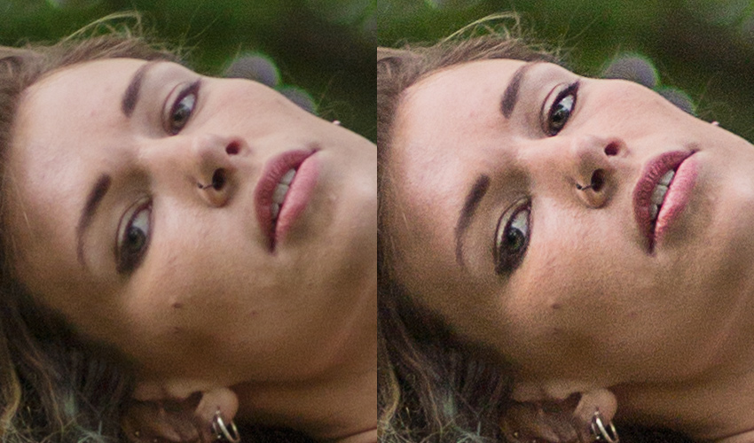

# Golem Image Sharpening

Using golem to sharpen your images.
GPL Version-3 license

# Why Sharpen Images?

- To overcome blurring by camera equipment
- To draw attention to certain areas 
- To increase legibility

RAW files from any modern camera are always slightly unsharp. Every step of the image capturing process introduces blur. As the light passes through the lens elements—no matter how well made—some definition is lost. 

When the sensor processes the photons falling on it, the sharpest transitions are averaged out and slightly blurred. When the three different colour channels are interpolated to create the final image, again, a small amount of blur is introduced.

Second, human eyes are attracted to contrast. When we look at a photo, we are drawn to the sharpest details. If you’re trying to direct a viewer, selective sharpening is one of the best ways to do it.

Finally, sharpening an image makes it easier to see important details. Text becomes easier to read, individual leaves stand out and faces in a crowd become more distinct.

# Straight out of camera file     v.s.    Sharpened file


# Installation
Step 1:
Follow Golem Tutorial https://handbook.golem.network/requestor-tutorials/flash-tutorial-of-requestor-development
```
yagna service run
yagna payment init -r
python3 -m venv ~/.envs/yagna-python-tutorial
source ~/.envs/yagna-python-tutorial/bin/activate
export YAGNA_APPKEY=insert-your-32-char-app-key-here
```
Step 2:
Run Frontend
```
npm install
npm run start
```
Step 3:
open your browser and go to:
http://localhost:3000/

# Reference 
https://photography.tutsplus.com/tutorials/what-is-image-sharpening--cms-26627

# Demo Video : How to use? 

Click below to watch demo video in youtube:

[](https://youtu.be/Y95OLHVt9G0)

